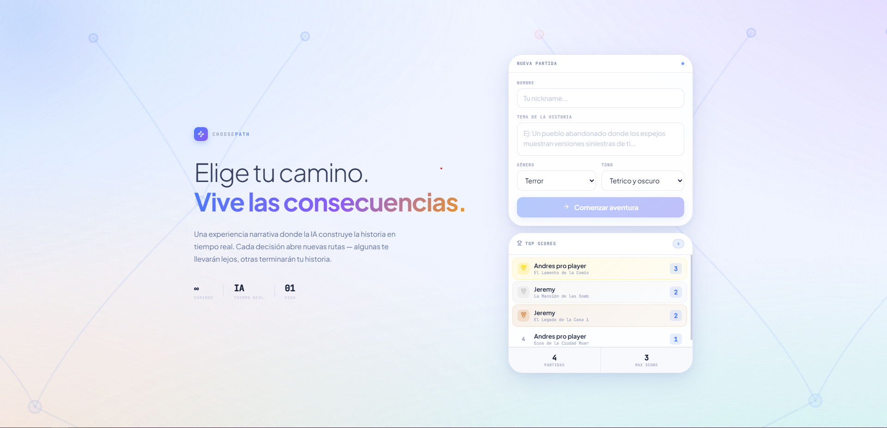
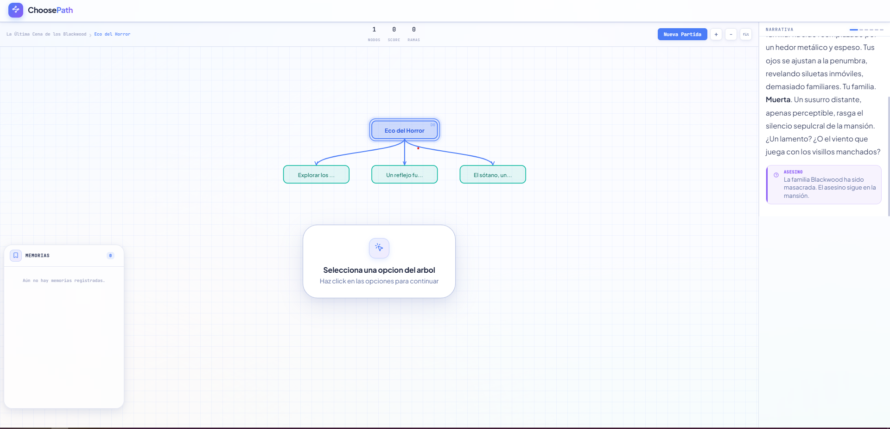
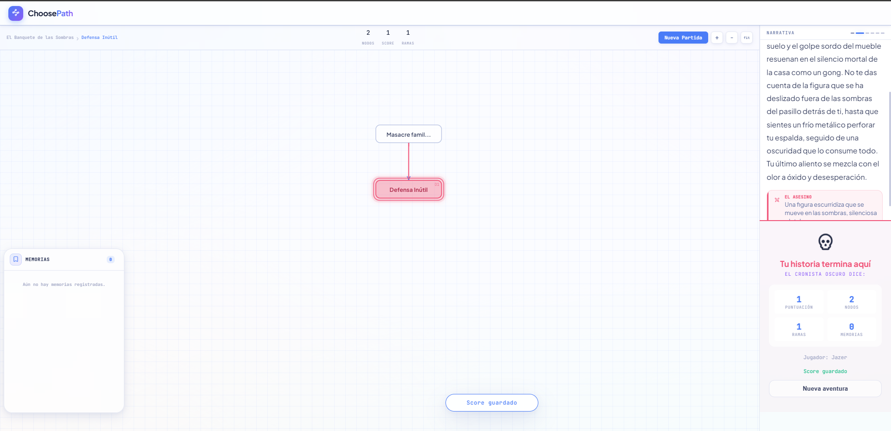

# ChoosePath - Interactive Narrative Adventure

<div align="center">



**[Jugar ahora](https://choose-path.cubepath.dev)** | **[GitHub](https://github.com/JeremyE7/ChoosePath_Frontend)**

</div>

---

## De que va este proyecto

Nos aburrimos de las novelas visuales donde todo está quemado y sigue un camino predeterminado. Queríamos algo más vivo, más impredecible. Así nació ChoosePath: una experiencia donde cada decisión que tomás ramifica la historia en tiempo real, gracias a inteligencia artificial.

No hay un final escrito. La historia se construye mientras jugás.

### Que encontraras

- **Narrativa que respira**: Las escenas se generan sobre la marcha con Google Gemini. Cada elección lleva a lugares que no existen hasta que los visitás.
- **El Árbol de las decisiones**: Una visualización interactiva donde puedes ver todo lo que has construido. Cada nodo es una decisión, cada conexión es un camino andado.
- **Memorias que importan**: Lo que haces en el pasado afecta lo que pasa después. El sistema de memorias hace que la IA recuerde tus acciones y las tenga en cuenta.
- **Tu nombre en el ranking**: Guardá tu puntuación y compará con otros jugadores en el scoreboard online.

---

## Stack Tecnologico

### Del lado del navegador
- **Angular 21** - Con signals, porque el futuro del estado reactivo está ahí
- **GSAP** - Las animaciones son lo que hace que la experiencia se sienta premium
- **Tailwind CSS 4** - Estilos rápidos y mantenibles
- **SVG** - El árbol de decisiones es puro SVG, interactivo y fluido

### Del lado del servidor
- **Express** - Servidor SSR para Angular, nada extraordinario
- **MongoDB** - Donde guardamos los scores de los jugadores
- **Google Gemini API** - El cerebro que genera las escenas

### Donde vive todo
- **CubePath** - Nuestra VPS casita en la nube
- **PM2** - El guardian que levanta la app si se cae

---

## CubePath: Donde Todo Succede

La hackaton nos dio la excusa perfecta para probar CubePath y la verdad es que fue una experiencia muy positiva.

### El servidor

Una VPS pequeña pero útil:
- **2GB de RAM** - Suficiente para lo que necesitamos
- **1 núcleo** - El que hace el trabajo
- **Ubuntu** - Porque siempre es Ubuntu

### MongoDB

Instalamos MongoDB en la misma máquina. Nada de servicios externos costosos. El scoreboard vive ahí:

```bash
# Lo básico
apt install mongodb
systemctl enable mongodb
systemctl start mongodb
```

### La aplicación

Después de hacer el build, la corro con PM2 para que no se muera si algo sale mal:

```bash
# Build
pnpm run build

# Arrancar con PM2
pm2 start dist/ChoosePath/server/server.mjs --name choosepath

# Para que arranque solo si se reinicia el servidor
pm2 startup
pm2 save
```

### Gemini API (el cerebro)

El servicio de IA es externo, claro. Usamos el modelo `gemini-2.5-flash` de Google. La clave se configura en el servidor y la app la usa sin que el usuario tenga que hacer nada.

## Cómo jugar

Es muy facil:

1. Arrancás desde la pantalla de inicio
2. Elegís un tema, un género y el tono de la historia (oscuro, cómico, dramático...)
3. Lees lo que pasa en el panel narrativo
4. Eliges una de las opciones disponibles
5. El Árbol crece con tu decisión
6. Sigues hasta que llegue el final (o hasta que mueras)
7. Guardás tu score y aparecés en el ranking

### Controles

- **Click** en una opción para tomarla
- **Scroll** para hacer zoom
- **Arrastrar** el fondo para moverte por el árbol

---

## Screenshots

| Pantalla de Inicio | Vista de Juego |
|-------------------|----------------|
|  |  |

| Panel de Muerte |
|-----------------|
|  |

---

## Estructura del Proyecto

```
ChoosePath/
├── src/
│   ├── app/
│   │   ├── components/
│   │   │   ├── tree-canvas/      # El árbol SVG
│   │   │   ├── narrative-panel/  # Donde leés la historia
│   │   │   ├── choice-panel/     # Las opciones
│   │   │   ├── start-screen/    # La puerta de entrada
│   │   │   ├── header/          # Stats y titulo
│   │   │   └── memory-*/       # Las memorias del jugador
│   │   ├── services/
│   │   │   ├── story.service.ts     # Todo lo de la IA y el estado del juego
│   │   │   ├── memory.service.ts   # Sistema de memorias
│   │   │   ├── score.service.ts    # Comunicacion con el backend de scores
│   │   │   └── narrator.service.ts # Mensajes del narrador
│   │   └── models/
│   ├── server/
│   │   ├── story.routes.ts       # Endpoints para generar historia
│   │   ├── score.routes.ts       # Scores
│   │   └── story.prompts.js       # Los prompts que mandamos a Gemini
│   └── environments/
└── dist/                         # El build productivo
```

---

## Para correrlo local

```bash
# Clonar
git clone https://github.com/JeremyE7/ChoosePath_Frontend.git
cd ChoosePath_Frontend/ChoosePath

# Dependencies
pnpm install

# Arrancar
pnpm start

# Abrir en http://localhost:4200
```

Si querés probar la generación con IA necesitás una clave de API de Google AI Studio. Creá un archivo `.env` con `GEMINI_KEY=tu_clave`.

---

## Criterios de Evaluación

Me comprometo con estos puntos:

### Experiencia de Usuario
- La interfaz responde instantáneamente
- Las animaciones guían sin molestar
- Todo se siente orgánico, no robotic

### Creatividad
- El árbol de decisiones es único visualmente
- La historia no lineal cambia según lo que hacés
- Las memorias funcionan como mecánica, no como gimmick

### Implementación Técnica
- Angular con signals, SSR, MongoDB funcionando
- La IA genera contenido que tiene sentido

### Utilidad
- Se puede jugar de principio a fin
- El scoreboard motiva a volver
- Es extensible para nuevos géneros y temas

---

<div align="center">

**Hecho con curiosidad para la Hackaton CubePath 2026**

</div>
